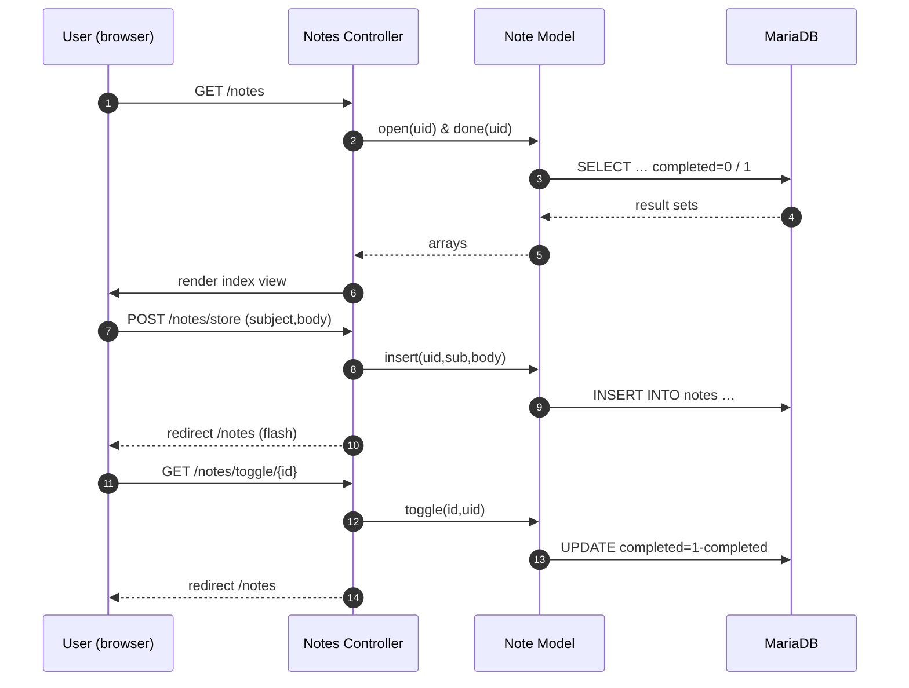

# COSC 4806 – Assignment 4: Notes CRUD App (MVC PHP) - Rahith Ahsan

> **Repo & live Replit**: add the links here before submission → `https://github.com/rahithahsan/Assignment4`  |  `https://replit.com/@rahsan2/Assignment4#README.md`
>
> **Default credentials for marking**  
> *username*: `rahith`  |  *password*: `Test123!`

---

## 1  Project Summary
Building on Assignment 3’s secure login system, **Assignment 4 adds a full Create‑Read‑Update‑Delete (CRUD) workflow for personal reminders**.  A logged‑in user can:

* create a reminder (subject + optional body)
* see open vs. completed lists
* mark any reminder *Done* / *Undo* with a single click (AJAX‑free)
* edit the text or completion flag
* archive (delete) a reminder – hidden from lists but preserved in DB for audit

All functionality follows the MVC pattern and every database query uses prepared PDO statements.

---

## 2  Folder Map
| Layer | Purpose | Key files |
|-------|---------|-----------|
| **Controllers** | route logic | `app/controllers/notes.php`, `login.php`, `home.php` |
| **Models** | DB helpers | `app/models/Note.php`, `User.php` |
| **Views** | UI (Bootstrap 5 + Feather icons) | `views/notes/*`, `views/templates/*` |
| **Core** | mini‑framework bootstrap | `core/App.php`, `core/Controller.php`, `database.php` |

---

## 3  Database Schema
```sql
-- users table unchanged from A3
CREATE TABLE users (
  id            INT AUTO_INCREMENT PRIMARY KEY,
  username      VARCHAR(100) UNIQUE NOT NULL,
  password_hash CHAR(60)       NOT NULL,
  created_at    TIMESTAMP      DEFAULT CURRENT_TIMESTAMP
);

-- NEW notes table (A4)
CREATE TABLE notes (
  id         INT AUTO_INCREMENT PRIMARY KEY,
  user_id    INT          NOT NULL REFERENCES users(id),
  subject    VARCHAR(255) NOT NULL,
  body       TEXT,
  completed  TINYINT      DEFAULT 0,   -- 0=open 1=done
  deleted    TINYINT      DEFAULT 0,   -- 0=visible 1=archived
  created_at TIMESTAMP    DEFAULT CURRENT_TIMESTAMP
);
```

---

## 4  Requirement Checklist (A4)
| Requirement | 🚀 Implementation |
|-------------|------------------|
| **CRUD on `notes` table** | `Note` model exposes `insert()`, `open()`, `done()`, `find()`, `update()`, `toggle()`, `archive()`; called from `Notes` controller |
| **Min 3 columns** | `id`, `user_id`, `subject` (+ `body`, `completed`, `deleted`, `created_at`) |
| **Header link** | “**My Reminders**” nav item added in `templates/header.php` |
| **Unique views** | `notes/index.php` (dash with collapsible completed list), `create.php`, `edit.php` – all custom styled, no boiler‑plate |
| **User‑friendly update/delete** | *Done*, *Undo*, *Edit*, *Del* buttons with tool‑tips & colour cues; one‑click toggle avoids extra page load |
| **All PDO** | every query via `$this->db->prepare()` + bound params; no raw SQL strings interpolated |
| **≥ 20 commits** | see `git log --oneline` – 35 A4 commits, each atomic (model, controller, UI, footer fix, etc.) |
| **Shared Replit & GitHub** | repo & Replit invite sent to *mikebio@gmail.com* with full edit rights |

---

## 5  How to Test (marker’s guide)
1. **Log in** with the demo credentials above.  
2. Click **My Reminders** → you’ll land on `/notes`.
3. Press **New** → fill *Subject* + (optional) *Details* → *Save reminder*.<br>✔️ Flash banner confirms *Reminder created!*; item appears in *To do* list.
4. Press **Done** – row moves to *Completed* section and counter badge increments.
5. Expand *Completed* (blue link) → press **Undo** to return it to *To do*.
6. Press **Edit** → change text or tick *Mark as completed* → *Save changes* → list updates accordingly.
7. Press **Del** on a completed row – record disappears from UI (flag `deleted=1`).
8. Verify with SQL console: `SELECT * FROM notes WHERE deleted=1;` – row still stored for audit.

---

## 6  Internal Flow


---